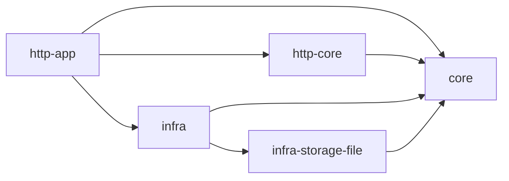
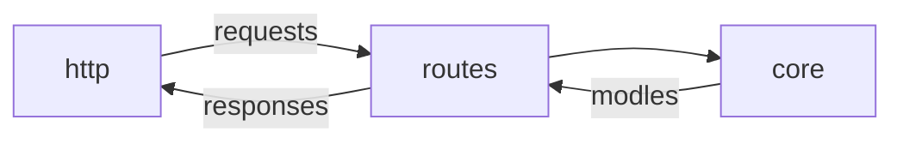
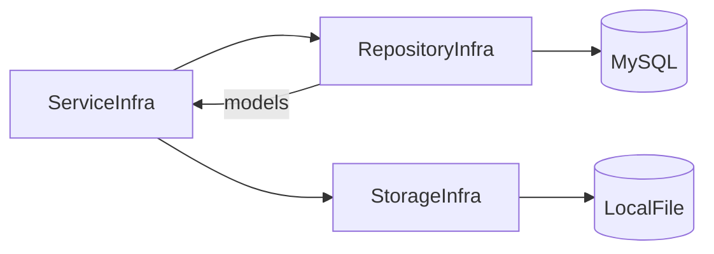

# What is this

Writing a sample of [actix-web](https://actix.rs/) application base on [isucon/isucon11-final](https://github.com/isucon/isucon11-final) for my study purpose.

# How to run test

```
$ docker-compose up -d
```

# Architecture Overview



## http-app
This crate handles http request using actix-web.
combine infra API.

## http-core
This crate does not depend on infra layer.



## infra
This crate handles DB or storage codes. don't handle HTTP



## infra-storage-file
This crate implement file storage code.

## core
core application API. don't handle HTTP

